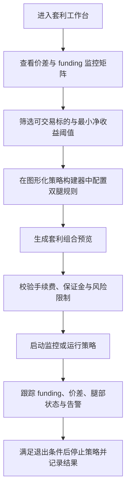

## 1. 产品概述
本项目面向加密套利研究员与半自动交易操盘手，构建一个围绕 `Python + ccxt + Grafana + 轻量高性能时序数据库` 的跨所永续套利监控与策略编排工作台。当前阶段仅交付单文件 HTML MVP，用于验证信息架构、交互路径与策略操作面板。

- 核心目标是把“同标的永续合约价差套利 + funding 费率修正 + 双腿组合交易”以可视化方式呈现，降低人工监控与策略搭建成本。
- 产品价值在于把研究报告中的静态信息升级为可持续使用的监控前台，为后续接入实盘数据、告警、下单编排、组合管理与时序分析奠定 UI 基础。

## 2. 核心功能

### 2.1 用户角色
| 角色 | 使用方式 | 核心权限 |
|------|----------|----------|
| 策略交易员 | 本地打开 HTML 文档或部署到内网页面 | 查看套利机会、配置策略参数、生成组合、启动/停止策略、查看风险状态 |
| 研究分析员 | 本地打开 HTML 文档或部署到内网页面 | 浏览监控指标、分析 funding 与价差、比较不同标的与交易所状态 |

### 2.2 功能模块
1. **套利总览工作台**：顶部概览、机会摘要、核心指标、状态筛选。
2. **同标的永续监控面板**：按标的展示 Binance / Hyperliquid 的标记价格、资金费率、净价差、预估净收益与优先级。
3. **Grafana 图表预留区**：用嵌入式卡片/占位容器展示 funding 曲线、价差曲线、累计收益与告警状态。
4. **图形化策略构建器**：通过可视化模块卡片串联“交易所选择 → 标的过滤 → 阈值判断 → 双腿下单 → 风险限制 → 平仓条件”。
5. **套利组合执行台**：展示组合腿、方向、名义价值、保证金占用、费率收益拆解与启动按钮。
6. **风险与事件日志区**：显示 funding 反转、滑点超限、腿部失衡、交易所连接异常等事件。
7. **时序数据概览区**：展示行情采样频率、交易事件吞吐、时序库状态、最近写入延迟与保留周期。

### 2.3 页面详情
| 页面名称 | 模块名称 | 功能描述 |
|-----------|-------------|---------------------|
| 套利工作台首页 | Hero 概览区 | 展示产品定位、当前监控模式、在线交易所、策略状态与快捷入口 |
| 套利工作台首页 | 机会摘要条 | 统计高优先级机会数、正收益组合数、预计资金费净收益、运行中策略数 |
| 套利工作台首页 | 标的筛选栏 | 按交易所、标的、最小净收益、funding 差阈值、风险等级进行筛选 |
| 套利工作台首页 | 永续价差监控矩阵 | 列表方式展示同标的在两所的价格、资金费率、归一化小时收益、手续费后净收益与可执行性 |
| 套利工作台首页 | Grafana 图表区 | 预留 funding spread、price spread、累计 funding PnL、告警时间线等图卡 |
| 套利工作台首页 | 图形化策略构建器 | 通过可拖拽/流程块式布局配置监控条件、下单方向、仓位大小、开平仓规则 |
| 套利工作台首页 | 组合交易预览卡 | 根据策略配置自动生成“Binance 多 / HL 空”或反向组合，并计算名义对冲关系 |
| 套利工作台首页 | 风险控制面板 | 配置最大单腿滑点、最小资金费优势、费率反转退出、杠杆上限与保证金缓冲 |
| 套利工作台首页 | 事件日志 | 展示机会触发、策略启动、组合平衡、风险告警与手动干预记录 |
| 套利工作台首页 | 时序数据状态卡 | 展示市场数据写入状态、交易回报入库状态、Grafana 数据源连通性与历史回放范围 |

## 3. 核心流程
用户首先进入套利工作台，查看同标的监控矩阵与 funding 差排序结果；随后通过图形化策略构建器设置筛选条件和组合规则，系统实时生成候选套利组合；用户确认净收益、手续费、风险参数后启动组合，页面进入运行监控态并持续显示 funding、价差、腿部状态与告警。系统未来会将实时行情、资金费率、成交回报、组合权益与事件日志持续写入高性能时序数据库，供 Grafana 查询、回放与告警。

## 4. 用户界面设计

### 4.1 设计风格
- 主色：深海军蓝与石墨黑作为背景基底，强化交易终端氛围。
- 强调色：交易所双主题色采用 Binance 金与 Hyperliquid 青绿，辅助色为策略紫与风险橙。
- 按钮风格：圆角矩形按钮与发光描边状态结合，关键执行按钮采用高对比渐变与悬停抬升效果。
- 字体建议：标题使用更有辨识度的中文展示字体，正文使用高可读中文无衬线，数字与费率采用等宽字体。
- 布局风格：桌面优先的双栏工作台，上方总览、中部监控矩阵、右侧策略构建、下方图表与日志。
- 图标风格：使用简洁线性图标与交易方向箭头，强调状态标签、费率方向、策略节点关系。

### 4.2 页面设计概览
| 页面名称 | 模块名称 | UI 元素 |
|-----------|-------------|-------------|
| 套利工作台首页 | Hero 概览区 | 深色渐变背景、状态徽标、摘要指标、短说明文字、主操作按钮 |
| 套利工作台首页 | 机会摘要条 | 紧凑型统计卡、正负色标签、趋势小图、数值动画 |
| 套利工作台首页 | 永续价差监控矩阵 | 高密度表格、方向箭头、交易所配色、阈值标签、行级 hover 高亮 |
| 套利工作台首页 | Grafana 图表区 | 深色图表卡、嵌入容器、时间粒度切换、占位骨架屏 |
| 套利工作台首页 | 时序数据状态卡 | 写入延迟徽标、存储保留标签、数据库健康状态、历史回放入口 |
| 套利工作台首页 | 图形化策略构建器 | 模块节点卡、连接线、参数表单、步骤说明、启动/重置操作区 |
| 套利工作台首页 | 组合交易预览卡 | 双腿结构图、保证金占比条、收益拆解、执行按钮组 |
| 套利工作台首页 | 风险与日志区 | 风险矩阵、状态灯、时间线日志、告警色高亮 |

### 4.3 响应式策略
- 采用桌面优先设计，优先适配 1280px 以上宽屏，用于研究员与交易员的桌面工作环境。
- 在平板宽度下将监控矩阵与策略构建器改为上下堆叠，保持关键指标与主按钮始终可见。
- 在移动端仅保留浏览与轻量筛选能力，图形化策略构建器降级为卡片流程展示，不强调触屏编辑能力。
