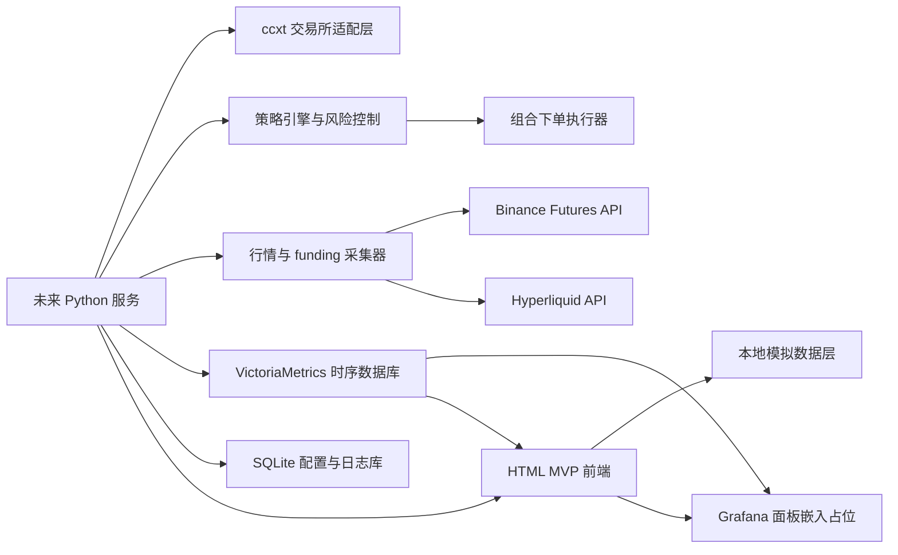
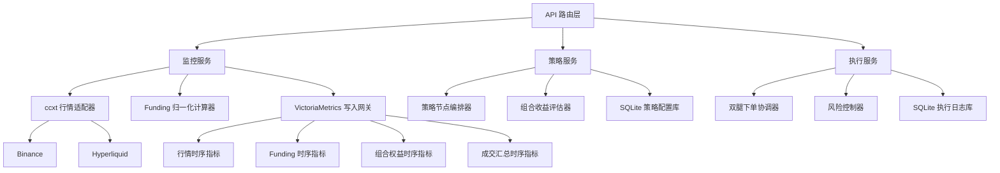
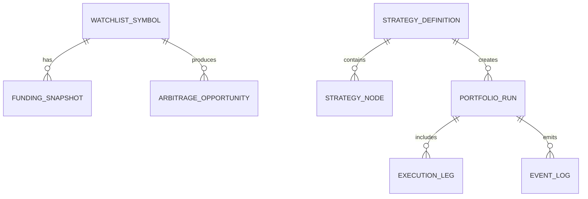

## 1. 架构设计
当前交付范围为单文件 HTML MVP，因此前端先以内聚型静态页面实现信息架构、交互状态与策略编排体验；同时预留未来基于 `Python + ccxt + Grafana + VictoriaMetrics` 的数据接入、时序分析与执行架构，避免后续推翻重做。



## 2. 技术说明
- 前端：`HTML5 + CSS3 + Vanilla JavaScript`，用于快速产出单文件静态 MVP 页面。
- 图形风格：CSS 变量驱动的深色终端设计系统，统一颜色、边框、阴影、间距与状态标签。
- 图表接入预留：通过 `iframe` 容器或图表占位卡片预留 Grafana 嵌入位，Grafana 默认连接 VictoriaMetrics 数据源。
- 数据与执行预留：`Python 3.12 + ccxt` 作为未来行情采集与统一交易接口。
- 时序数据库：使用 `VictoriaMetrics Single` 存储实时行情、funding 费率、组合净值、成交汇总与风控指标，具备良好的 Grafana 兼容性、较低资源占用与稳定的时序写入性能。
- 配置与明细日志：推荐 `SQLite` 存储策略定义、节点配置、组合运行记录与详细执行日志，避免非时序数据挤占时序库存储模型。
- 热数据访问：可选 Redis 作为最新快照缓存层，用于页面秒级刷新与风控即时读取。
- 实盘服务预留：建议后续采用 `FastAPI` 暴露监控、策略配置、组合执行与日志接口。
- 时序写入方式：Python 采集服务通过 VictoriaMetrics 兼容的 Prometheus Remote Write、导入接口或聚合写入层批量写入，Grafana 通过 PromQL 生态或兼容查询链路展示。
- 初始化方式：当前阶段不初始化完整前后端项目，仅创建项目说明级 HTML 原型文件。

## 3. 路由定义
| 路由 | 用途 |
|-------|---------|
| `/` | 套利监控与策略构建单页工作台，展示总览、监控矩阵、策略构建器、组合预览、图表区与事件日志 |

## 4. API 定义
虽然当前阶段仅交付 HTML 文档，但为保证后续 `Python + ccxt` 接入顺滑，MVP 文档预留以下接口契约。

### 4.1 获取监控快照
`GET /api/monitor/snapshot`

```ts
type ExchangeName = "binance" | "hyperliquid";

type SymbolSnapshot = {
  symbol: string;
  exchange: ExchangeName;
  markPrice: number;
  indexPrice: number;
  fundingRateHourly: number;
  nextFundingTime: string;
  takerFee: number;
  makerFee: number;
  sourceLagMs: number;
};

type OpportunitySnapshot = {
  symbol: string;
  longExchange: ExchangeName;
  shortExchange: ExchangeName;
  fundingSpreadHourly: number;
  estimatedNetHourly: number;
  suggestedLeverage: number;
  status: "watch" | "ready" | "blocked";
};

type MonitorSnapshotResponse = {
  generatedAt: string;
  symbols: SymbolSnapshot[];
  opportunities: OpportunitySnapshot[];
  storage: {
    backend: "victoriametrics";
    writeLatencyMs: number;
    retentionDays: number;
  };
};
```

### 4.2 创建策略草稿
`POST /api/strategies`

```ts
type StrategyNodeType =
  | "exchange_selector"
  | "symbol_filter"
  | "funding_threshold"
  | "spread_guard"
  | "position_sizer"
  | "hedge_executor"
  | "risk_guard"
  | "exit_rule";

type StrategyNode = {
  id: string;
  type: StrategyNodeType;
  label: string;
  config: Record<string, string | number | boolean>;
};

type CreateStrategyRequest = {
  name: string;
  symbol: string;
  nodes: StrategyNode[];
  enabled: boolean;
};

type CreateStrategyResponse = {
  strategyId: string;
  status: "draft" | "active";
};
```

### 4.3 启动组合交易
`POST /api/portfolios/run`

```ts
type RunPortfolioRequest = {
  strategyId: string;
  symbol: string;
  longExchange: ExchangeName;
  shortExchange: ExchangeName;
  notionalUsd: number;
  leverage: number;
  maxSlippageBps: number;
};

type RunPortfolioResponse = {
  portfolioId: string;
  runStatus: "queued" | "running" | "rejected";
  reason?: string;
};
```

### 4.4 查询历史时序数据
`GET /api/timeseries/query`

```ts
type TimeseriesMetric =
  | "mark_price"
  | "funding_rate"
  | "funding_spread"
  | "net_hourly_yield"
  | "portfolio_equity"
  | "execution_fill";

type TimeseriesQueryResponse = {
  metric: TimeseriesMetric;
  symbol: string;
  points: Array<{
    ts: string;
    value: number;
    exchange?: ExchangeName;
  }>;
};
```

## 5. 服务端架构图


## 6. 数据模型

### 6.1 数据模型定义


### 6.2 数据定义说明
| 实体 | 关键字段 | 说明 |
|------|----------|------|
| `watchlist_symbol` | `symbol`, `base_asset`, `quote_asset`, `enabled` | 监控标的主表 |
| `funding_snapshot` | `symbol`, `exchange`, `mark_price`, `funding_rate_hourly`, `captured_at` | 各交易所 funding 与价格快照 |
| `arbitrage_opportunity` | `symbol`, `long_exchange`, `short_exchange`, `estimated_net_hourly`, `status` | 计算后的套利机会记录 |
| `strategy_definition` | `name`, `symbol`, `enabled`, `created_at` | 图形化策略定义 |
| `strategy_node` | `strategy_id`, `node_type`, `config_json`, `sort_order` | 策略节点与参数配置 |
| `portfolio_run` | `strategy_id`, `symbol`, `run_status`, `notional_usd`, `leverage` | 组合交易运行实例 |
| `execution_leg` | `portfolio_id`, `exchange`, `side`, `quantity`, `order_status` | 组合双腿执行明细 |
| `event_log` | `portfolio_id`, `event_type`, `severity`, `message`, `created_at` | 写入 SQLite 的风险、执行、系统事件日志 |
| `market_timeseries` | `symbol`, `exchange`, `metric`, `ts`, `value` | 写入 VictoriaMetrics 的统一市场时序指标 |
| `trade_timeseries` | `portfolio_id`, `exchange`, `metric`, `ts`, `value` | 写入 VictoriaMetrics 的交易与组合时序指标 |

### 6.3 MVP 实现约束
- 当前 HTML MVP 不直接调用真实接口，仅使用静态示例数据和占位图卡模拟运行状态。
- 所有“启动策略”“运行组合”“同步下单”按钮仅提供交互演示，不执行真实交易。
- 页面结构必须为未来接入 `Python + ccxt + Grafana + VictoriaMetrics` 预留可替换区域，包括监控表格、图表容器、策略节点区、时序状态卡与日志区。
- 设计需保持单文件可打开、可演示、可移交，便于后续扩展为完整 Web 应用。
